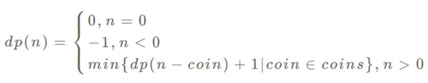

# 全排模式

#### 基本思想：

回溯的思想，类似于 `BF 算法` ，试图产生所有可能的解决方案，但每次生成解决方案测试如果它满足所有条件，那么只有继续生成后续解决方案。否则回溯并继续寻找不同路径的解决方案。

#### 基础题型：

举例有n个数字，从小到大按序输出它们所有的排列组合（全排列问题）。

```javascript
function findNext(arr,cur=[]){
    if(!arr.length){console.log(cur)}
    for(let i=0,l=arr.length;i<l;i++){
        cur.push(arr[i])//做选择
        let temp=[].concat(arr)//是浅拷贝但不影响
        temp.splice(i,1)
        findNext(temp,cur)//做下一次选择
        cur.pop()//取消选择
    }
}

//测试，输入[1,2,3]
findNext([1,2,3])

//输出结果
[ 1, 2, 3 ]
[ 1, 3, 2 ]
[ 2, 1, 3 ]
[ 2, 3, 1 ]
[ 3, 1, 2 ]
[ 3, 2, 1 ]
```

注：findNext中的arr放输入数组，cur放最后统计的数组。

这是基本的回溯题，回溯出所有可能性，未加任何限制。

其中使用了循环套递归的模式，每次循环都是做出一次决策，对决策结果递归，然后再取消决策。

这是一种经典模式，所有回溯都在此模式基础上加以限制和变形。

为什么说是DFS，思考二叉树中的DFS递归实现方法，是先后执行dfs\(node.left\)和dfs\(node.right\)，而这里的枚举，也是树的形式（称为决策树，如下图），只不过将二叉树变成了n叉树，用循环N次代替dfs\(node.left\)和dfs\(node.right\)。



时间复杂度为 O\(n!\)。

一般情况下，无安全无条件的回溯问题（例如上面这个问题）是很消耗性能的，所以经单题都会加上一些限制条件，减少遍历次数或每次遍历的节点数。

#### 经典题目

八皇后问题。

#### 注释

`BF算法`：暴力算法，Brute Force。

#### 参考文献




