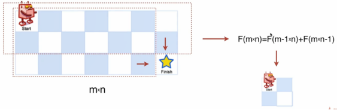

# 不同路径

#### 1.题目（力扣截图）


#### 2. 找到状态转移方程

由于题中规定了只能向右走或者向下走，因此到当前状态，可以由两种状态转移而来，因此F\(m\*n\)等于前两种状态走法相加：



因此状态转移方程是：`f(m*n)=f((m-1)*n)+f(m*(n-1))`。

由于题目中还提到了有障碍物，因此在递归体中还要加入判断某条状态是否可达，不可达则返回。

#### 3. 确定边界（base case）

```javascript
f(1*2)=1
f(2*1)=1
```

